# AWS Setup

## Cognito

An outline of steps:

1. Create a User Pool
2. Create a Client Application
3. Create a Custom Domain Name
4. Create a Federated Identity Pool
   * Set the user pool and client application as Authentication Provider
   * Allow unauthenticated user acces
   * Allow Cognito to create roles for authenticated and unauthenticated users

### User Pool

1. From Cognito, click **Manage User Pools**,  then click **Create a User Pool**
2. Provide a name for the pool. (The demo uses`api-auth-demo` )
3. You can **Review Defaults** or **Step through Settings**. (These instructions walk through settings.)


* Set sign-in settings such as use *username* or *email address*
* Set required attributes

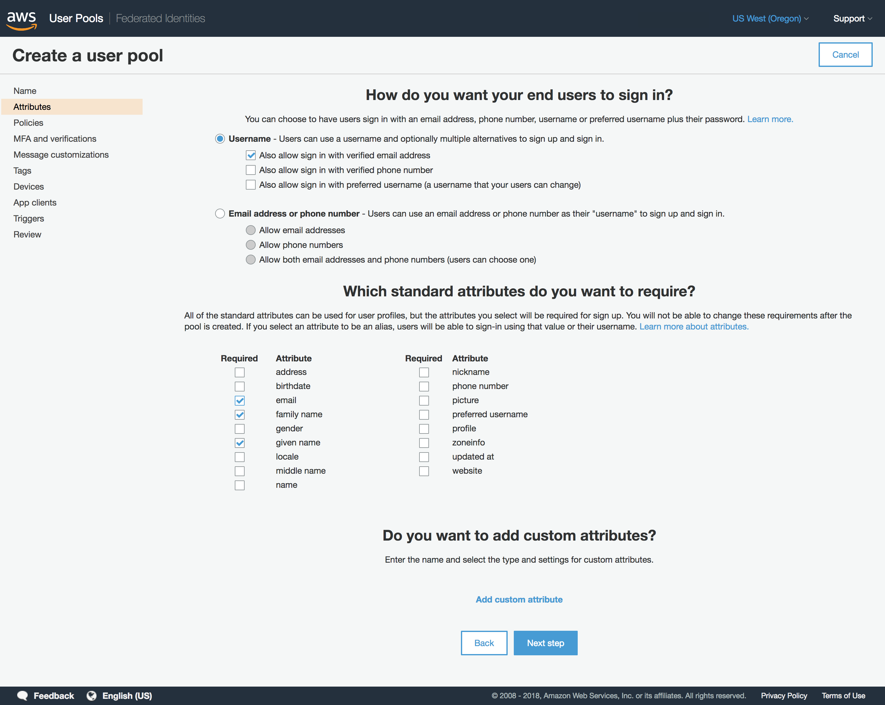


 * password policy
 * allow user signup

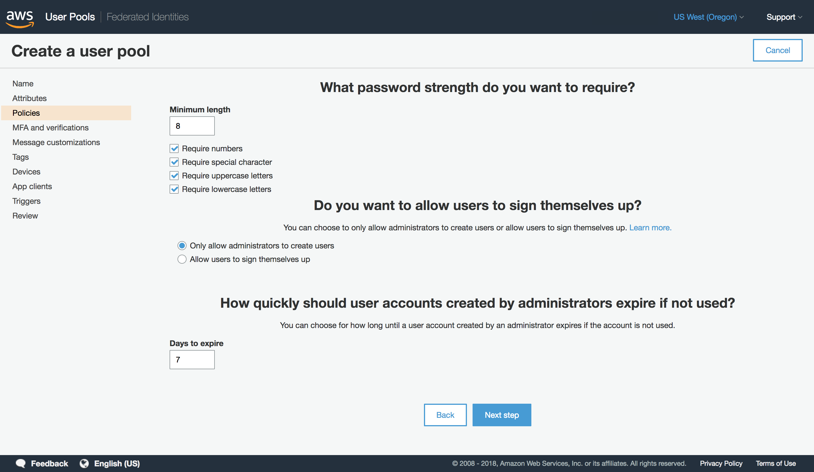


* MFA
* Verification Options
* IAM Role for sending SMS to users

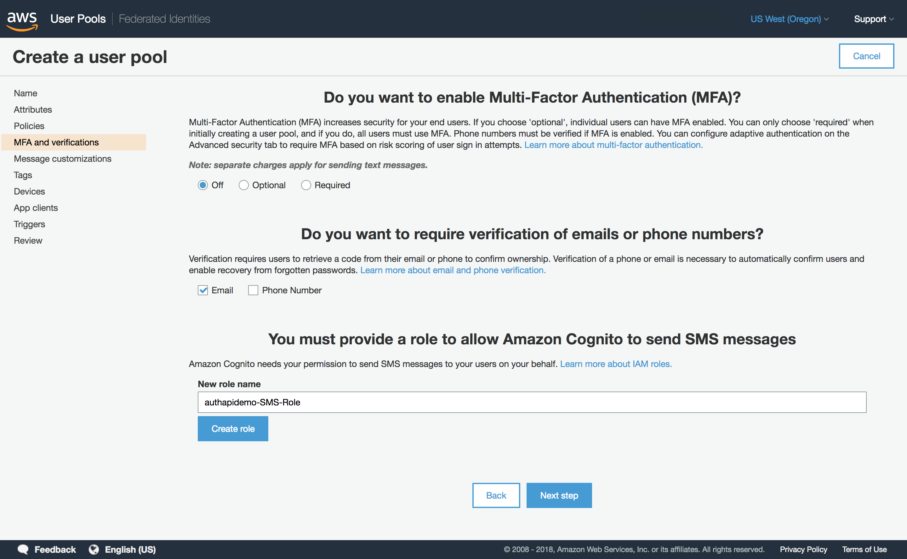


* Customize email messages

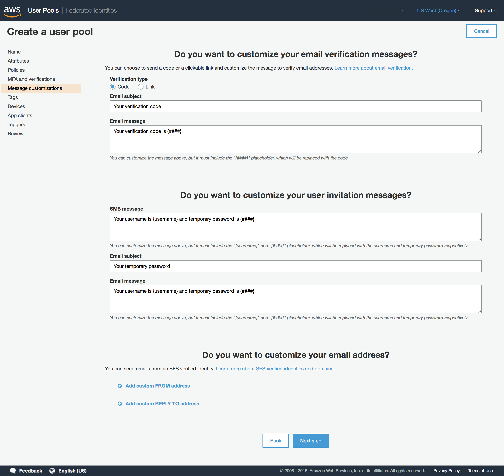


* tags

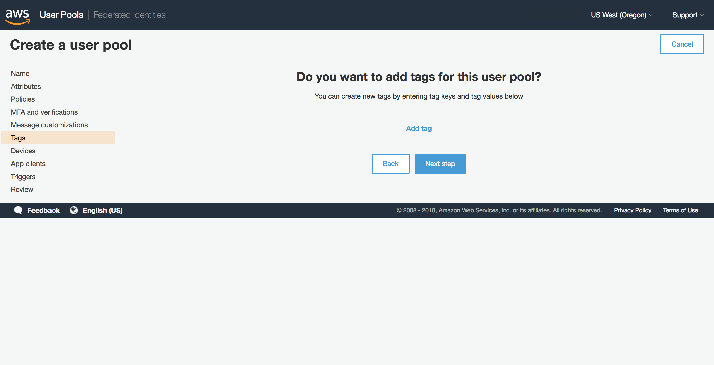


* [remember user devices](https://docs.aws.amazon.com/cognito/latest/developerguide/amazon-cognito-user-pools-device-tracking.html)

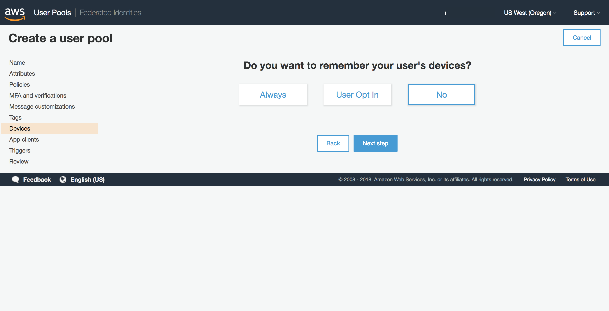


* specify or create an application client (can also be done later)
* NOTE: don't check the "Generate client secret" checkbox

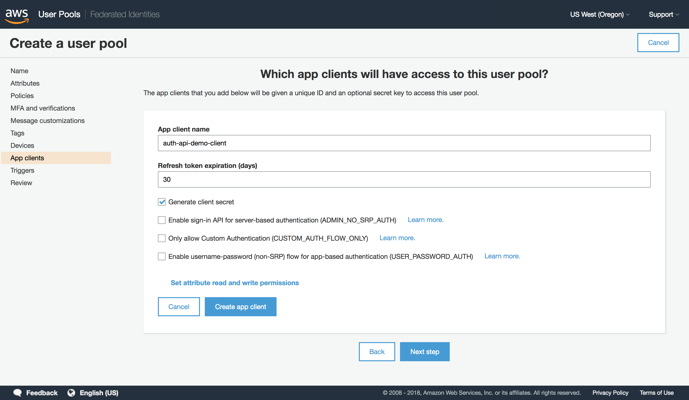


* [custom triggers](https://docs.aws.amazon.com/cognito/latest/developerguide/cognito-user-identity-pools-working-with-aws-lambda-triggers.html)


* verify settings, create the pool


### App Client Settings

* Click **App client settings** in left sidebar
* enter authenication *callback URLs* and *Signed out URLs*

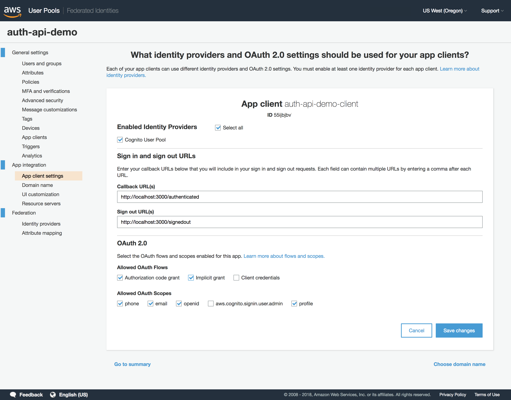

### App Clients

If the `aws.cognito.signin.user.admin` scope is enabled, its permissions are set from *General Settings, App clients*

Read and write settings, by attribute are specified, for the app client. 

NOTE: If `aws.cognito.signin.user.admin` is enabled, a user could extract session tokens from the browser and use the Cognito API (as the app client would) to read/write attributes. This may or may not be desired, depending on the individual application.

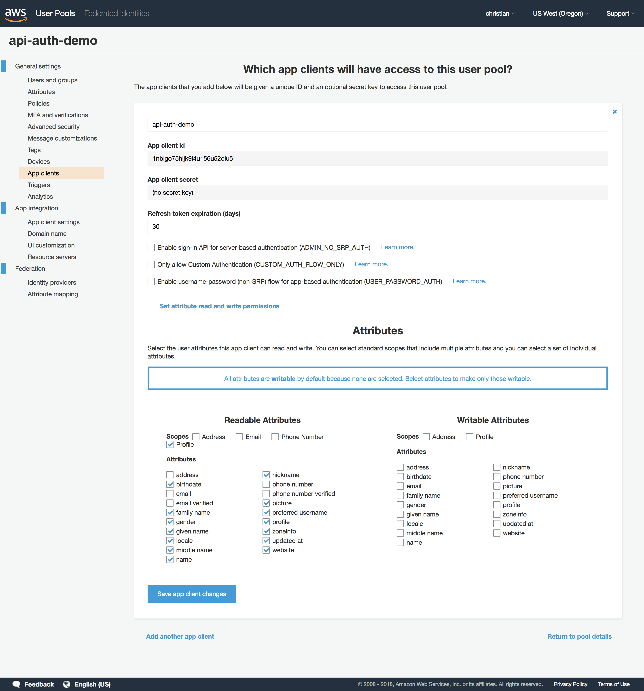 

### Domain Name

Select a custom subdomain (needs to be unique across AWS) or a custom domain. We will use a subdomain, which is easier to setup. (More on custom domains can be found [here](https://docs.aws.amazon.com/cognito/latest/developerguide/cognito-user-pools-add-custom-domain.html).)

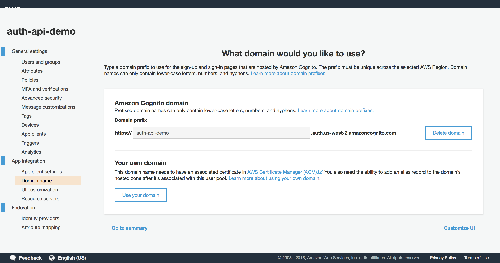

### Federated Identity Pool

* From the Cognito main page, click **Manage Identty Pools**, then click **Create new identity pool**
* Under *Authentication Providers*, enter the *User Pool ID* and *App Client ID* created in the earlier steps
* check *Enable access to unauthenticated identities*

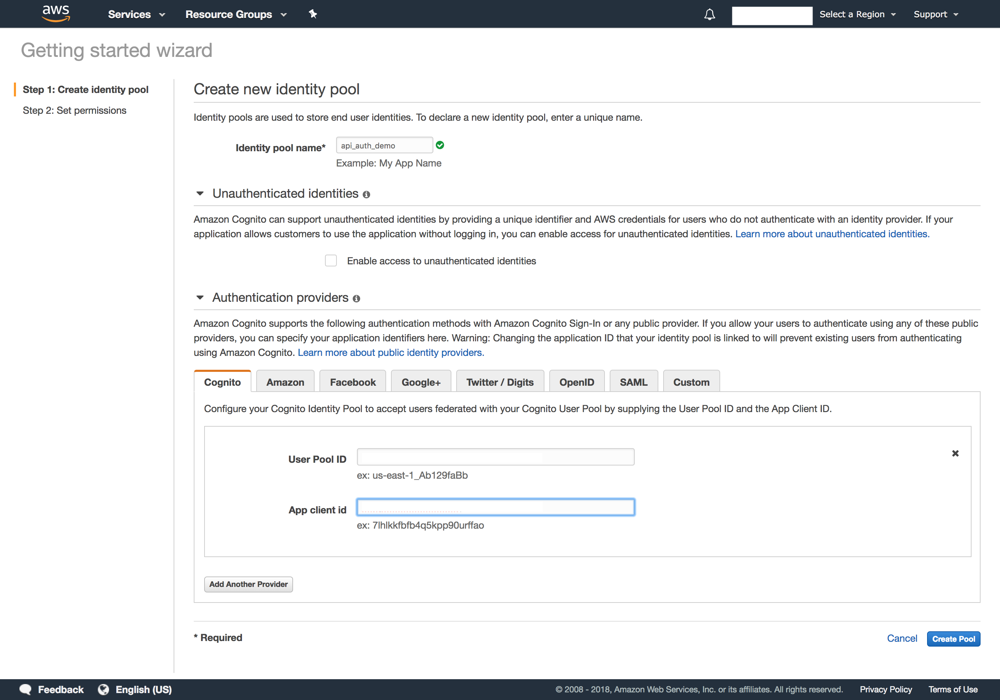


* Click **Create new role** for *Unauthenticated Role* and *Authenticated Role* ([Doc are here](https://docs.aws.amazon.com/cognito/latest/developerguide/identity-pools.html))

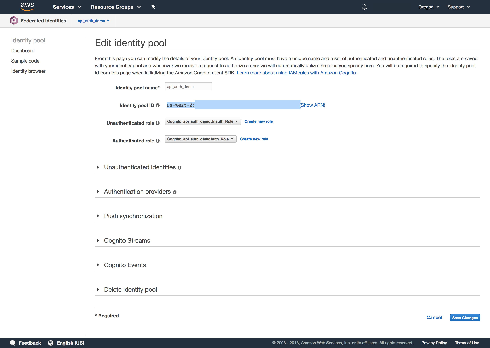

*Note*: We will also explicitly allow unauthenticated users. In this configuration, Cognito will assign authenticated users to one IAM role, and unauthenticated users to another IAM role.
        It is isn't necessary to assign unauthenticated users to an IAM role. But if you want to have explicit control over unauthenticated user policy, via IAM vs. authenticated users, it can be useful.

## API Gateway

[Claudia.js](https://claudiajs.com/) will create the API resources, but the following is to create a usage policy for the API, which will be tied to an API key.

### Usage Plan

* From the API Gateway console, click **Usage Plans** on the left sidebar.

* Provide a name

* Optionally set *Throttling* and *Quota*

  

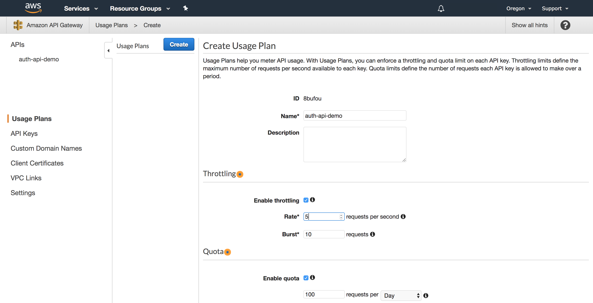

### API Key

* From the API Gateway console, click **API Keys** on the left sidebar.
* click **Create API key** from the *Actions* menu button
* specify a name and let the key auto-generate
* click **Save**
* click **Add to Usage Plan**
* enter the name of the Usage Plan created earlier


While API keys can used as an authentication mechanism, we will use it for policy enforcement. We will use AWS Cognito for authentication. As noted, the API key enables our throttle policy. We will simply use one API key for all requests - you could create an API key per user (using a Cognito triggers) or whatever key assignment scheme you'd like.

## IAM

Many of the IAM roles will be automatically be created by Cognito and Claudia.js. But the *authenticated user role* needs to be edited to provide access to appropriate resources. (In the demo, this is a single API method.)

The ARN for the API Gateway resources, for the authorized user to acces, is needed.

* From the API Gateway, go to the API created with Claudia.js
* Click **Resources** and then the method to be protected
* in the *Method Request*, select the ARN (in yellow below)
* wildcards can be used to specify multiple methods once the base ARN is known

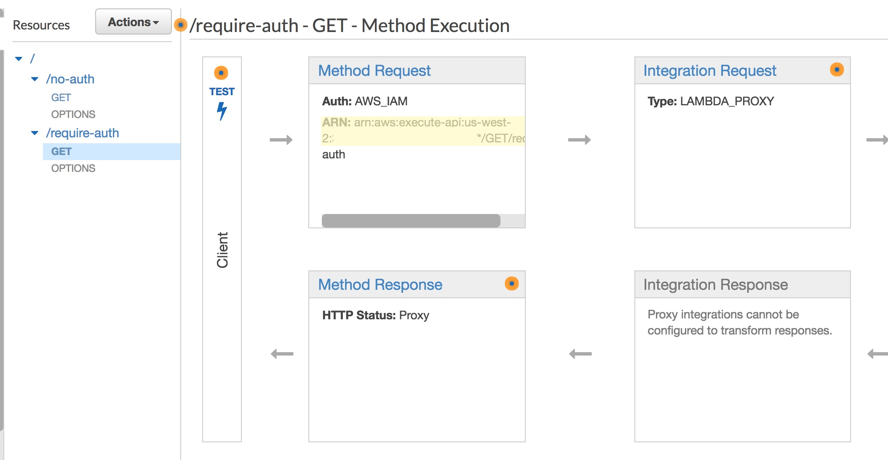


For the IAM role,

* From the IAM console, find the authenticated user role
  * If Cognito created it, it will be named `Cognito_<pool_name>AuthRole`
* There may be an `Invoke_<api>` policy in the role. If not create a new policy

Edit the policy's JSON to

```json
{
    "Version": "2012-10-17",
    "Statement": [
        {
            "Action": [
                "execute-api:Invoke"
            ],
            "Resource": "arn:aws:execute-api:<ARN FOR API RESOURCE>",
            "Effect": "Allow"
        }
    ]
}
```


------

That's all!